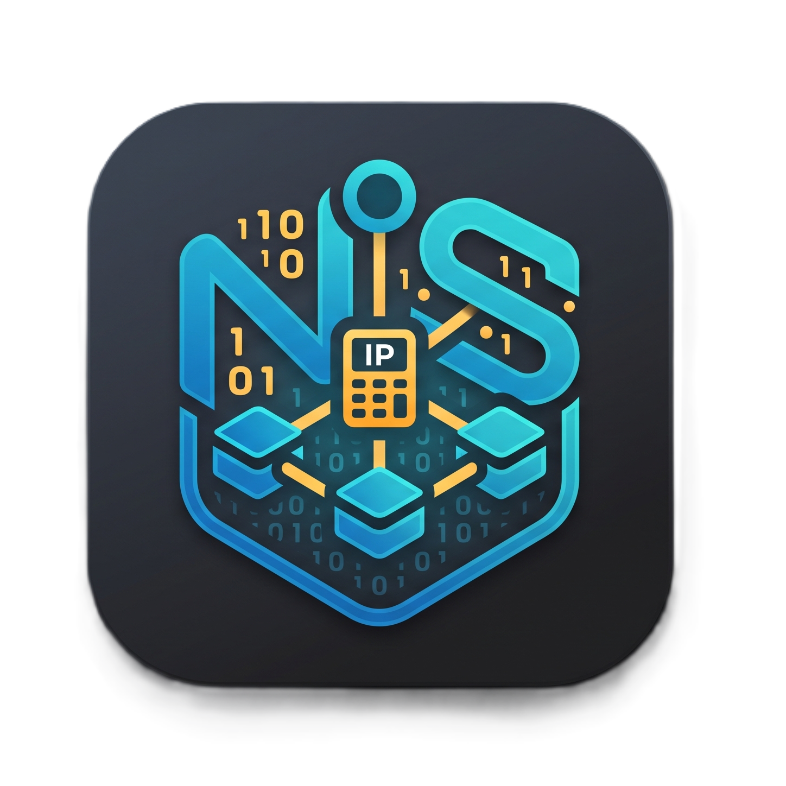

<p align="center">
  
</p>

# 🌐 جناح أدوات الشبكات وتقسيم IPv4 (Network Tools Suite)

<p align="center">
  <a href="https://flutter.dev"></a>
  <a href="https://dart.dev"></a>
  <a href="https://m3.material.io"></a>
  <a href="https://www.cisco.com"></a>
  <a href="https://docs.hivedb.dev"></a>
</p>

<p align="center">
  <a href="../README.md"><b>📖 English README (العودة إلى المستند الرئيسي بالإنجليزية)</b></a>
</p>

---

## 🚀 نبذة عن المشروع

تطبيق **Network Tools Suite** هو تطبيق متقدم متعدد المنصات (Android, Web, Desktop) مصمم خصيصاً لمهندسي الشبكات، طلاب تكنولوجيا المعلومات، ومدربي شهادات **Cisco CCNA/CCNP**. يعتمد التطبيق على معمارية الكود النظيف (**Clean Architecture**)، إدارة الحالة باستخدام **BLoC**، ونظام تصميم **Material 3** التفاعلي لتوفير أدوات دقيقة وسريعة لحساب وتقسيم شبكات IPv4 وتوليد أوامر شبكات Cisco.

---

## ✨ ميزات التطبيق الرئيسية

| الأداة | الميزات التفصيلية |
|---|---|
| 🧮 **حاسبة شبكات IPv4** | حساب شامل لقناع الشبكة (Netmask)، القناع العكسي (Wildcard)، عنوان الشبكة، عنوان البث (Broadcast)، مدى الأجهزة المتاحة، العناوين الثنائية والست عشرية، والعنوان العكسي (`in-addr.arpa`). |
| 📊 **التقارير الفنية المستقلة** | شاشة تقرير هندسي شامل (`IpDetailsPage`) تحتوي على خريطة البتات الـ 32 التفاعلية، مؤشر سعة الأجهزة، والمُعرّفات المتقدمة مع إمكانية نسخ التقرير بضغطة زر. |
| 🔀 **محرك تقسيم VLSM** | حاسبة تقسيم الشبكات المتغير حسب احتياج الأجهزة لكل قسم وفق معايير Cisco CCNA، مع إظهار نسبة الكفاءة والعناوين المهدورة وشاشة تقرير الخطة (`VlsmDetailsPage`). |
| 💻 **مولد أوامر Cisco CLI** | توليد تلقائي لأوامر راوترات ومفاتيح Cisco تشمل: إعدادات الواجهات، الواجهات الفرعية 802.1Q، عناوين IP Helper، التوجيه الثابت (Static Routes)، وقوائم التحكم بالوصول (ACLs). |
| 🧩 **خريطة البتات الـ 32 التفاعلية** | تمثيل تفاعلي ملون لبتات الشبكة وبتات الأجهزة (`BitGridWidget`) يتيح للمستخدم استكشاف وتغيير حالة أي بت ومعاينة تأثيره على العنوان العشري فورياً. |
| 📖 **جدول CIDR المرجعي الشامل** | شاشة مرجعية كاملة (`CidrLookupPage`) لجميع بادئات IPv4 الـ 33 من `/0` إلى `/32` مع تصفية سريعة بحسب الفئات (A, B, C) وبحث حساس للسوابق. |
| 🔄 **محول الأنظمة الرقمية** | تحويل فوري ومباشر بين النظام العشري، النظام الثنائي 32-bit (المفصول بنقاط)، والنظام الست عشري مع صناديق نسخ مستقلة لكل صيغة. |
| 🏷️ **مصنف الفئات والبيئة** | تصنيف عناوين IPv4 إلى الفئات (Class A, B, C, D Multicast, E Experimental)، وتحديد بيئة العنوان (خاص RFC 1918، عام، استرجاعي Loopback). |
| 📏 **مولد المدى المتسلسل** | توليد قائمة عناوين IP المتسلسلة بين بداية ونهاية محددة مع ترقيم عناصر القائمة وإمكانية النسخ الفردي أو الجماعي. |
| ⭐ **سجل النشاطات والمفضلة** | حفظ تلقائي لجميع الحسابات السابقة وقائمة المفضلة بالنجمة باستخدام قاعدة البيانات المحلية السريعة Hive. |
| 🌍 **دعم كامل للغتين (عربي/إنجليزي)** | واجهة متكاملة باللغتين العربية (RTL) والإنجليزية (LTR) مع ضبط خطوط ممتازة (`Cairo` و `Inter`) وتبديل نمط الإضاءة (Light/Dark Mode). |

---

## 🏗️ هيكلية المشروع (Architecture)

تم بناء المشروع باتباع مبادئ **Clean Architecture** وتقسيم الموديولات حسب الميزات:

```
lib/
├── core/
│   ├── network/             # الخوارزميات البرمجية البحتة لحسابات IPv4 ومحرك Cisco
│   ├── theme/               # نظام التصميم Material 3 (الأبعاد، الألوان، والخطوط)
│   ├── utils/               # ممتدات التحريك والانتقال بين الشاشات (AppPageRoutes)
│   └── widgets/             # العناصر المشتركة (BitGridWidget, CidrLookupPage, IpInputField)
├── features/
│   ├── home/                # لوحة التحكم الرئيسية وشريط البانر
│   ├── ip_calculator/       # إدارة حالة الحاسبة وشاشة التقرير الفني المستقلة
│   ├── cisco_vlsm/          # محرك تقسيم VLSM وشاشة التقرير التفصيلي
│   ├── cisco_cli/           # واجهة مولد أوامر أجهزة Cisco IOS
│   ├── subnet_calculator/   # حاسبة التقسيم المتساوي للشبكات
│   ├── range_calculator/    # مولد مدى العناوين المتسلسلة
│   ├── ip_converter/        # محول الأنظمة الرقمية
│   ├── ip_classifier/       # مصنف الفئات والبيئات
│   └── history/             # قاعدة بيانات السجل والمفضلة المحفوظة محلية Hive
├── l10n/                    # ملفات الترجمة المزدوجة (EN & AR)
└── main.dart                # نقطة انطلاق التطبيق وتهيئية قاعدة بيانات Hive
```

---

## ⚙️ متطلبات وتشغيل المشروع

### المتطلبات الأساسية
- **Flutter SDK**: الإصدار `3.0.0` أو أحدث
- **Dart SDK**: الإصدار `3.0.0` أو أحدث
- بيئة تطوير **Android Studio** أو **VS Code** مع إضافات Dart & Flutter

### خطوات التشغيل

1. **استคลون المستودع:**
   ```bash
   git clone https://github.com/your-username/network_tools.git
   cd network_tools
   ```

2. **تثبيت الاعتمادات والحزم:**
   ```bash
   flutter pub get
   ```

3. **فحص سلامة الكود:**
   ```bash
   flutter analyze
   ```

4. **تشغيل التطبيق:**
   ```bash
   # التشغيل على محاكي أو جهاز متصل
   flutter run

   # أو التشغيل على متصفح Chrome
   flutter run -d chrome
   ```

---

## 🎨 نظام التصميم وتجربة المستخدم (UI/UX)

- **توحيد القياسات (Tokens):** استخدام كلاس `AppSpacing` لتوحيد المسافات وحواف البطاقات والأيقونات.
- **تباين النصوص العالي:** استخدام `AppTextTheme` بألوان Slate محددة وصريحة لضمان وضوح جميع النصوص في الوضعين الفاتح والداكن.
- **حماية كاملة من الطفح (Overflow Protections):** استخدام `Expanded` و `TextOverflow.ellipsis` في كافة عناصر `Row` و `Column` لضمان تجاوب الواجهة بنسبة 100% على كافة أحجام الشاشات.

---

## 📄 الترخيص (License)

هذا المشروع مرخص بموجب رخصة **MIT**. راجع ملف [LICENSE](../LICENSE) للمزيد من التفاصيل.

تم التطوير بحب 💙 لمهندسي الشبكات والطلاب ومحترفي شهادات Cisco.
